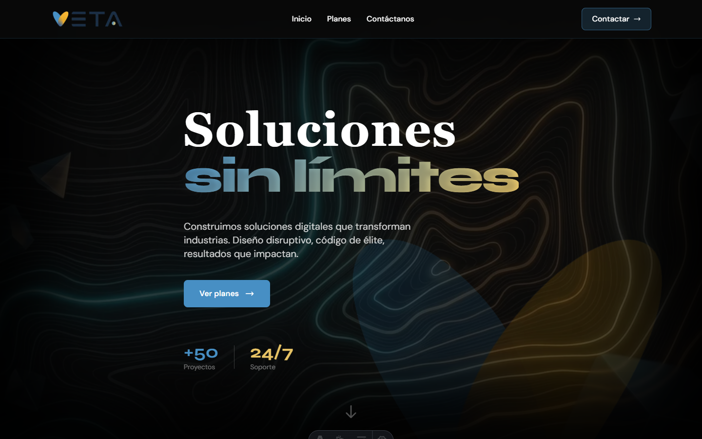
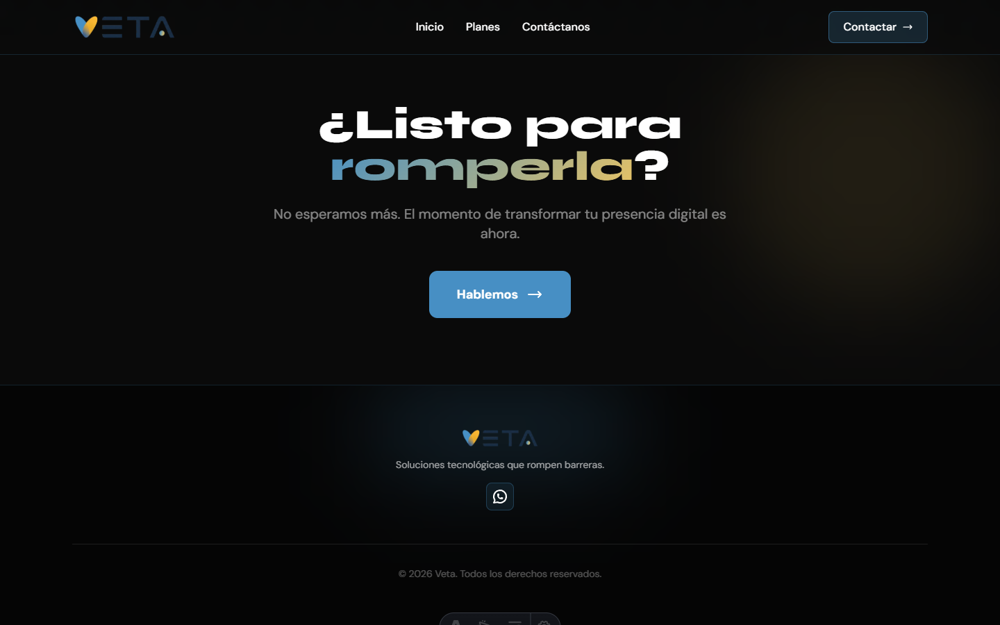
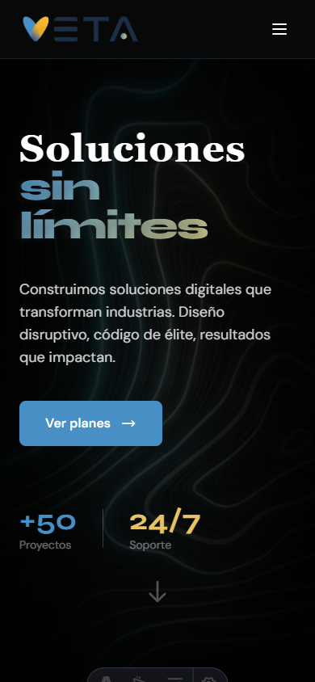

# Veta - Soluciones Tecnológicas Disruptivas



> Transformamos ideas en realidades digitales. Diseño disruptivo, código de élite, resultados que impactan.

---

## Características

- **Diseño Premium**: Interfaz moderna y elegante con animaciones fluidas
- **100% Responsive**: Optimizado para desktop, tablet y móvil
- **Rendimiento Ultra Rápido**: Construido con Astro para carga instantánea
- **SEO Optimizado**: Meta tags, Open Graph y schema markup incluidos
- **Accesibilidad**: Navegación por teclado y screen readers optimizada

---

## Stack Tecnológico

| Tecnología                                                                                      | Propósito             |
| ----------------------------------------------------------------------------------------------- | --------------------- |
|                  | Framework web         |
|  | Estilos utility-first |
|   | Tipado estático       |
|               | Despliegue            |

---

## Vista Previa

### Desktop

#### Hero Section


#### Planes y Precios



#### Sección de Contacto


### Móvil

#### Hero Mobile



---

## Desarrollo Local

```bash
# Clonar el repositorio
git clone https://github.com/faOC20/esunveta-landing.git

# Entrar al directorio
cd esunveta-landing

# Instalar dependencias
npm install

# Iniciar servidor de desarrollo
npm run dev

# Construir para producción
npm run build
```

---

## Estructura del Proyecto

```
├── public/
│   ├── screenshots/     # Capturas del proyecto
│   └── images/           # Recursos estáticos
├── src/
│   ├── components/       # Componentes Astro
│   ├── layouts/          # Layouts principales
│   ├── pages/            # Páginas del sitio
│   └── styles/           # Estilos globales
├── astro.config.mjs      # Configuración de Astro
├── tailwind.config.mjs   # Configuración de Tailwind
└── package.json
```

---

## Despliegue

El sitio está desplegado en **Vercel** y disponible en:

### **[esunveta.com](https://esunveta.com)**

---

## Contacto

¿Tienes un proyecto en mente? Hablemos.

[](https://api.whatsapp.com/send/?phone=584125775296)

---
